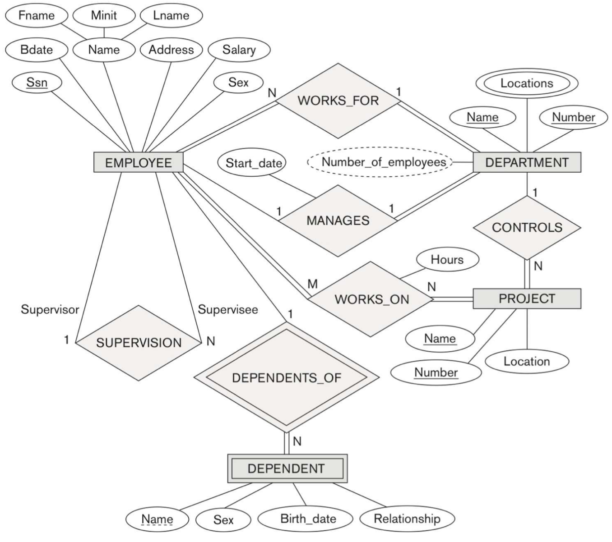
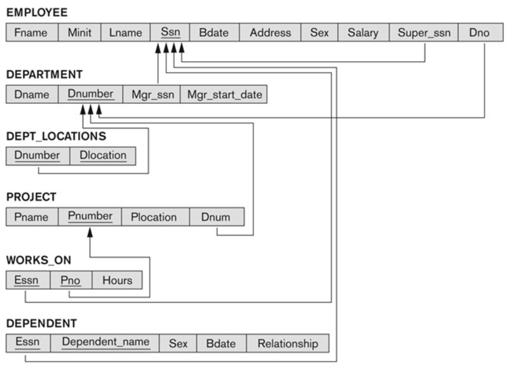
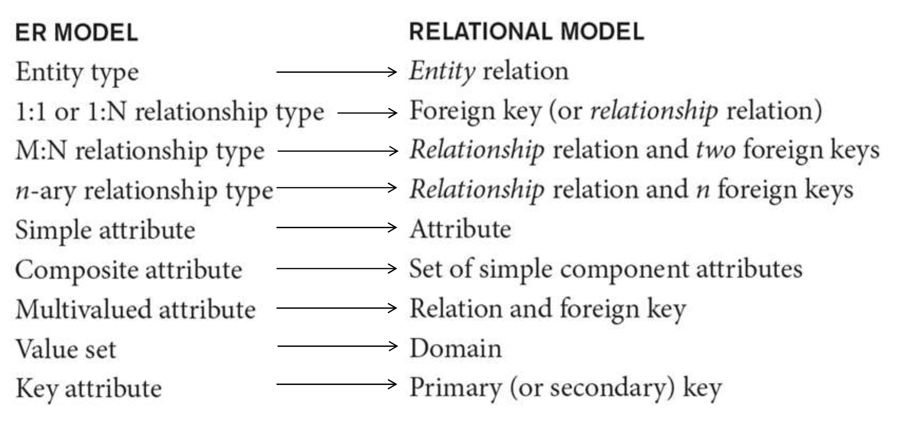

# ER-to-Relational Mapping

 

**An ER Schema for COMPANY**

 

       

 
 
 

**The Relational Schema for COMPANY**

 

       

 
 

**1. 모든 정보(모든 Attribute 포함)을 보존한다.**

**2. 가능한 한 제약을 유지한다.**

• 관계형 모델에서는 모든 제약 조건을 유지할 수 없다.

• ex) ER에서 1:10과 같은 최대 cardinality ratio

**3. null 값을 최소화한다.**

• 가능한 한 구체적으로 한다.

• 이것은 Logical Schema에서 Physical Schema로의 Mapping을 돕는다.

## Step1: Mapping of Regular Entity Types

- ER Schema의 각 강력한 **Entity Type E**에 대해 E의 모든 Attribute을 포함하는 **Relation R**을 만든다.

- E의 Key Attribute 중 하나를 R의 **Primary Key**로 선택한다.

- E의 선택된 Key가 Composite(합성)인 경우 Key에 대해 선택된 단순 Attribute Set은 함께 R의 PK가 된다.E

## Step2: Mapping of Weak Entity Types

- Entity Type E가 있는 ER Schema의 각 Weak Entity Type W에 대해, Relation R을 만들고 W의 Attribute을 R의 Attribute로 포함한다.

- Entity Type에 해당하는 Relation의 **PK Attribute**을 R의 **Foreign Key (FK) Attribute**로 포함한다.

- **R의 PK는 부모의 PK와 Weak Entity W의 partial key (있는 경우)의 조합이다.**

  - ex) The DEPENDENT relation PK: **{Essn, Dependent_name}**

## Step 3: Mapping of Binary 1:1 Relationship Types

- ER Schema의 각 **Binary 1:1 Relation Type R**에 대해 참여하는 Entity Type에 해댱하는 **Reltaion S 및 T를 식별한다.**

  **1. Foreign key approach (2 relations) option:**

  - Relation 중 하나를 선택한다. (S)

  - S의 경우 R에 **전체 참여가 있는 Entity 유형**을 선택하는 것이 좋다.

  - **T의 PK를 S의 FK로 포함한다.**

  - ex) ER Schema의 MANAGES 관계 유형

    - **Relation S** : DEPARTMENT entity type (총 참여로 인해)

    - **Relation T** : EMPLOYEE entity type

      - The **FK** of **S** (ex. the DEPARTMENT relation):

      - Mgr_Ssn **←** The **PK** (ex. Ssn) of **T** (ex. the EMPLOYEE relation)

  **2. Merged relation (1 relation) option:**

  - 두 Relation을 하나로 합친다. 이는 두 참여가 모두 total일 경우 적합하다.

   

  **3. Cross-reference or relationship relation (3 relations) option:**

  - Entity Type을 나타내는 두 Relation S 및 T의 PK를 상호 참조할 목적으로 **세 번째 Relation U를 설정한다.**

  - **U의 PK는 S와 T의 FK 중 하나이다. 다른 FK는 U의 unique key가 된다.**

## Step 4: Mapping of Binary 1:N Relationship Types

- 각 일반 Binary 1:N Relation Type R에 대해 N-side에 참여하는 Entity Type을 나타내는 **Relation S**를 식별한다.

- Relation T(R에 참여하는 다른 Entity Type)의 PK를 S에 FK에 포함한다.

- **1:N Relation Type**의 모든 simple attribute을 S의 attribute로 포함한다.

- ex) The **WORKS_FOR** relationship type in the ER schema

  - **Relation S**: The EMPLOYEE entity type (N-side)

  - **Relation T** : The DEPARTMENT entity type (1-side)

  - **The FK (Dno) of S**: borrowed from the PK, Dnumber of T

## Step 5: Mapping of Binary M:N Relationship Types

- 각 일반 **Binary M:N Relation Type R**에 대해 **Relationship Relation**이라 하는 새 **Relation U**를 생성하여 R을 나타낸다.

- 참여 Entity type을 나타내는 Reltion의 PK를 U에 FK Attribute로 포함한다. 그 것들의 조합은 **U의 PK를 형성한다.**

- **M:N Relation Type의 모든 simple attribute을 U의 Attribute로 포함한다.**

- ex) The **WORKS_ON** relationship type in ER

  - **Relation U** : The WORKS_ON relationship type

  - **FKs** (Essn and Pno) : EMPLOYEE 및 PROJECT Relation의 PK(Ssn 및 Pnumber)에서 각각 차용

  - **PK** : {Essn, Pno}

  - One attribute : Hours, from Hours of WORKS_ON

## Step6: Mapping of Multi valued Attributes

- 각 **multivalued attribute A에** 대해 새 **Relation U**를 만든다.

- Relation U에는 다음이 포함된다.

  - A에 해당하는 Attribute

  - **FK**, 예를들어 K 또는 A를 Attribute를 소유하는 **Entity Type의 PK** (PK: {A, K})

- ex) The **Locations** multi-valued attribute of Department

  - **Relation U**: the **DEPT_LOCATIONS** relation

  - **A**: **Dlocation**, from **Locations of the DEPARTMENT** entity type

  - **FK**: **Dnumber**, from the **PK of the DEPARTMENT** entity type

  - **PK**: {Dlocation, Dnumber}

## Step 7: Mapping of N-ary Relationship Types

- **n > 2인 각 n-ary Relation Type R**에 대해 새 **Relationship Relation U**를 생성하여 R을 나타낸다.

- 참여하는 Entity Type을 나타내는 Relation의 **PK**를 U에 **FK** Attribute로 포함한다.

- n-ary Relation Type의 모든 simple attribute을 U의 Attribute로 포함한다.

- ex)

  - **Relation U** : The **SUPPLY** relation

  - **PKs/FKs** : {Sname, Partno, ProjName}

  - **The other attribute** : **Quantity**

## ER과 Relational Model 간의 대응

  

