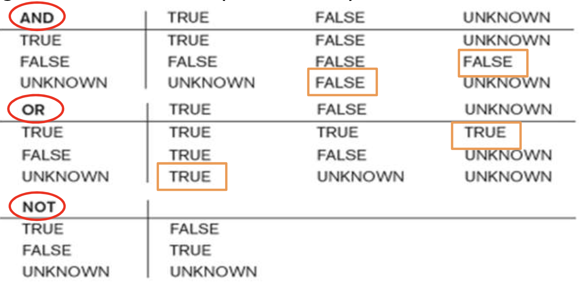

> 여러 기능을 통해 사용자는 데이터베이스에서 더 복잡하고 흥미로운 검색을 수행할 수 있다.

- **Nested queries** (중첩 질의)

- **JOIN** 

- **Grouping**

- **VIEW**

- **Assertion & Trigger**


# NULL & Three-Valued Logic

<hr />

> SQL 은 three-valued logic을 사용한다.

- **TRUE**, **FALSE**, **UNKNOWN**

- **NULL = NULL** 은 평가할 수 없다.

<div style="text-align: center">
 
</div>

<br />

- **SQL은 속성 값이 NULL인지 확인하는 쿼리를 허용한다.**

  ```sql
  SELECT Fname, Lname
  FROM EMPLOYEE
  WHERE Super_ssn IS NULL;
  ```

<br />
<br />

# Nested Queries (중첩 질의)

<hr />

> 외부 쿼리라고 하는 다른 쿼리의 WHERE clause 내에서 (중첩) 하위 쿼리 또는 내부 쿼리라고 하는 완전한 select-from-where 블록이 있을 수 있다.

```sql
SELECT DISTINCT Pnumber
FROM PROJECT
WHERE
    Pnumber IN
    -- Inner query 1
    (
        SELECT Pnumber
        FROM PROJECT, DEPARTMENT, EMPLOYEE
        WHERE Dnum = Dnumber AND Mgr_ssn = Ssn AND Lname = 'Smith'
    )
    OR
    Pnumber IN
    -- Inner query 2
    (
        SELECT Pno
        FROM WORKS_ON, EMPLOYEE
        WHERE Essn = Ssn AND Lname = 'Smith'
    );
```

**집합/다중 집합 비교 연산자: IN**을 사용한다.

- 값 v를 값 V의 집합(또는 다중 집합)과 비교한다.

- v가 V의 요소 중 하나인 경우 **TRUE**로 평가한다.

- **값의 튜플**을 비교하는 데 사용할 수 있다.

  - 비교를 수행하려면 튜플을 '()' 안에 배치한다.

```sql
SELECT DISTINCT Essn
FROM WORKS_ON
WHERE (Pno, Hours) IN (
    SELECT Pno, Hours
    FROM WORKS_ON
    WHERE Essn = '123456789'
);
```

<br />

- 다른 비교 연산자를 사용하여 단일 값 v를 비교할 수 있다.

- ex) 값이 중첩 쿼리의 **모든** 값을 초과한다.

  ```sql
  SELECT Lname, Fname
  FROM EMPLOYEE
  WHERE Salary > ALL (
      SELECT Salary
      FROM EMPLOYEE
      WHERE Dno = 5
  );
  ```

  <br />

- 잠재적인 오류와 모호성을 피하기 위해 SQL 쿼리에서 참조하는 모든 테이블에 대해 **aliases**(별칭)을 만든다.

  ex) **1. 이름이 같은 부양가족이 있고**, **2. 해당 직원과 성별이 동일한** 각 직원의 이름을 검색합니다.

  ```sql
  SELECT E.Fname, E.Lname
  FROM EMPLOYEE
  WHERE E.Ssn In (
      SELECT Essn
      FROM DEPARTMENT D
      WHERE E.Fname = D.Dependent_name AND E.Sex = D.Sex
  );
  ```

  - **correlated nested query (상호 연관된 중첩 질의)** : 외부 쿼리의 각 튜플에 대해 한 번씩 평가된다.

<br />
<br />

# SQL의 (NOT) EXISTS 함수

<hr />

> **correlated nested query**의 결과가 ‘not empty’ 또는 ‘empty’ 인지 확인한다.

- **correlated nested query**와 함께 사용할 수 있다.

- **TRUE 또는 FALSE 결과를 반환하는 Boolean 함수이다.**

  - 상관 중첩 쿼리에서 반환된 튜플이 없는 경우 (NOT) EXISTS는 (TRUE) FALSE를 반환한다.

```sql
SELECT Fname, Lname
FROM EMPLOYEE
WHERE
    EXISTS (
        SELECT *
        FROM DEPARTMENT
        WHERE Ssn = Essn
    )
    AND EXISTS (
        SELECT *
        FROM DEPARTMENT
        WHER Ssn = Mgr_Ssn
    );
```

<br />

**SQL에서 다음과 같은 방식으로 이중 부정을 사용할 수 있다.**

(...하지 않은 튜플들은 존재하지 않는다 -> ...한 튜플들만 존재한다.)

ex) "Dno = 5" 가 제어하는 "모든" 프로젝트에서 작업하는 직원의 이름을 검색합니다.

**=>** 직원들이 **참여하지 않는 5번 부서의 Project가 존재하지 않는** 그러한 직원들의 이름을 나열하라.

```sql
SELECT E.Fname, E.Lname
FROM EMPLOYEE E
WHERE NOT EXISTS (
    (
        SELECT P.Pnumber
        FROM PROJECT P
        WHERE Dnum = 5
    )
    MINUS  -- 'EXCEPT' in the SQL standard
    (
        SELECT W.Pno
        FROM WORKS_ON W
        WHERE E.Ssn = W.Essn
    )
);
```

<br />
<br />

# SQL에서의 Explicit Sets

<hr />

WHERE clause에서 **explicit set of values** (명시적 값 집합)을 사용할 수 있다.

```sql
SELECT DISTINCT Essn
FROM WORKS_ON
WHERE Pno IN (1, 2, 3);
```

<br />
<br />

# Join

<hr />

> Join이란 여러 테이이블에 흩어져 있는 정보 중 사용자가 필요한 정보만 가져와서 가상의 테이블처럼 만들어 결과를 보여주는 것으로 2개의 테이블을 조합하여 하나의 열로 표현하는 것이다.

```sql
SELECT Fname, Lname, Address
FROM (EMPLOYEE JOIN DEPARTMENT ON Dno = Dnumber)
WHERE Dname = 'Research'
```

1. **명시적 조인 표현**

- 명시적 조인표현 에서는 테이블에 조인을 하라는 것을 지정하기 위해 '**JOIN**' 키워드를 사용하고 **ON**의 키워드를 조인에 대한 구문을 지정하는데 사용한다.

```sql
SELECT *
FROM EMPLOYEE INNER JOIN DEPARTMENT
ON EMPLOYEE.DepartmentID = DEPARTMENT.DepartmentID;
```

=> **INNER JOIN**은 키 값이 있는 테이블의 컬럼 값을 비교 후 조건에 맞는 값을 가져오는 것이다. 간단히 말하면 **서로 연관된 내용만 검색하는 조인 방법**이다.

(**INNER**는 생략가능하다.)

2. **암시적 조인 표현**

- 암시적 조인 표현은 SELECT 구문의 FROM절에서 콤마(,)를 사용하여 단순히 조인을 위한 여러 테이블을 나여할하기만 하면된다.

```sql
SELECT *
FROM EMPLOYEE, DEPARTMENT
WHERE EMPLOYEE.DepartmentID = DEPARTMENT.DepartmentID;
```

<br />

### Natural Join

두 테이블 간의 동일한 이름을 갖는 모든 컬럼들에 대해 등가조인(**EQUIJOIN JOIN**)을 수행한다.

<div style="text-align: center">
    
</div>

Natural Join을 사용하면 공통된 속성을 찾아 같은 값을 갖는 항목끼리 결합시켜준다.

만약 같은 값을 갖는 항목이 없다면 해당 항목은 제외한다.

```sql
SELECT * FROM instructor NATURAL JOIN teaches
```

SQL은 마찬가지로 FROM 절의 결합할 두 테이블 사이에 NATURAL JOIN 키워드를 넣어주면 된다.

<br />

### Outer Join

**Outer Join**은 공통된 부분만 결합하는 **Inner Join**과 다르게 공통되지 않은 row도 유지한다.

이 때, 왼쪽 테이블의 row를 유지하면 **Left Outer Join**, 오른쪽 테이블의 row를 유지하면 **Right Outer Join**, 양쪽 테이블의 row를 모두 유지하면 **Full Outer Join**이다.

<div style="text-align: center">
    
</div>

```sql
SELECT * FROM instructor I LEFT OUTER JOIN teaches T ON I.id=T.id
```

**LEFT OUTER JOIN**을 수행하면 왼쪽 테이블(instructor)을 기준으로 id가 일치하는 row만 결합되고, 일치하지 않는 부분은 null 값으로 채워진다.

<br />

### Multiway JOIN in the FROM clause

**Multiway**(다중) 조인은 **JOIN**을 중첩하여 지정할 수 있습니다.

```sql
SELECT Pnumber, Dnum, Lname, Address, Bdate
FROM (
    (
        PROJECT JOIN DEPARMENT ON Dnum = Dnumber
    )
    JOIN EMPLOYEE ON Mgr_ssn = Ssn
)
WHERE Plocation = 'Stafford';
```

<br />
<br />

# Grouping

<hr />

### Aggregate Functions in SQL

Built-in aggregate functions: **COUNT, SUM, MAX, MIN, AVG**

- 일반적으로 **GROUP BY** clause을 통한 그룹화

  - 튜플의 하위 그룹 생성

- 전체 그룹을 선택(또는 조건을 적용)하기 위해서는 **HAVING** clause을 사용한다.

- **Aggregate Functions**(집계 함수)는 **SELECT** clause과 **HAVING** clause에서 사용할 수 있다.

```sql
SELECT SUM(Salary), MAX(Salary), MIN(Salary), AVG(Salary)
FROM EMPLOYEE;

SELECT COUNT (E.Lname)
FROM EMPLOYEE E LEFT OUTER JOIN EMPLOYEE S ON E.Super_ssn = S.Ssn;
```

**NULL은 튜플을 제외하고 값을 계산할 때 버려진다.**

<br />

### GROUP BY Clause

> 튜플의 하위 집합으로 관계를 분할한다.

- 속성을 기반으로 동일한 값을 가진다. (각 그룹에 독립적으로 적용할 수 있다.)

- 그룹화 속성은 SELECT 절에 나타나야 한다.

```sql
SELECT Dno, COUNT (*) as nEmps, AVG (Salary) as avgSal
FROM EMPLOYEE
GROUP BY Dno;

--        DNO      NEMPS     AVGSAL
-- ---------- ---------- ----------
--          1          1      55000
--          4          3      31000
--          5          4      33250
```

<br />

### **HAVING Clause**

> 그룹을 선택하거나 거부하는 조건을 제공한다.

```sql
SELECT Pnumber, Pname, COUNT (*) as numEmps
FROM PROJECT, WORKS_ON
WHERE Pnumber=Pno
GROUP BY Pnumber, Pname
HAVING COUNT(*) > 2;
```

<br />
<br />

# WITH Clause

<hr />

> **특정** 쿼리에서만 사용되는 (임시) 테이블을 정의할 수 있다.

편의상 임시 **View**를 만들고 쿼리에서 즉시 사용한다. (called an in-line view)

```sql
WITH SOMEDEPTS AS
    (
        SELECT Dno
        FROM EMPLOYEE
        GROUP BY Dno
        HAVING COUNT (*) >= 2
    )
SELECT e.Dno, COUNT (*) >= nEmps
FROM EMPLOYEE e, SOMEDEPTS b
WHERE Salary > 40000 AND e.Dno = b.Dno
GROUP BY e.Dno;
```

<br />
<br />

# CASE Clause

<hr />

> "특정 조건"에 따라 값이 다를 수 있는 경우 사용한다. 값이 예상되는 SQL 쿼리의 모든 부분에서 사용할 수 있다.

**튜플을 쿼리, 삽입 또는 업데이트할 때 적용 가능하다.**

```sql
UPDATE EMPLOYEE
SET Salary =
CASE WHEN Dno = 5 THEN Salary + 2000
     WHEN Dno = 4 THEN Salary + 1500
     WHEN Dno = 1 THEN Salary + 3000
```

<br />
<br />

# Recursive Queries in SQL

<hr />

> 동일한 유형의 튜플 간의 관계를 추적하는 데 사용할 수 있다. (ex. employee vs supervisor)

```sql
--[In the SQL standard]
WITH RECURSIVE SUP_EMP (SupSsn, EmpSsn) AS
    (
        SELECT Super_Ssn as SupSsn, Ssn as EmpSsn FROM EMPLOYEE
        UNION
        WHERE E.Super_Ssn = S.EmpSsn
    )
SELECT *
FROM SUP_EMP;
```

```sql
--[In Oracle]
SELECT Super_Ssn, Ssn as EmpSsn
FROM EMPLOYEE
START WITH Ssn = '123456789'
CONNECT BY PRIOR Super_Ssn = Ssn;

-- SUPER_SSN EMPSSN
-- --------- ---------
-- 333445555 123456789
-- 888665555 333445555
--           888665555
```

<br />
<br />

# VIEWS(Virtual Tables) In SQL

<hr />

> View란 다른 테이블에서 파생된 단일 테이블을 말한다. 필수적으로 채워지지 않은 가상 테이블이다.

**View**는 **자주 요청되는** **Join** 결과를 **캐싱**하기 위해 사용된다.

<br />

## Specification of Views in SQL

### CREATE VIEW

> View(가상 테이블) 이름, 속성 및 view 정의를 포함한다. 즉, View의 내용을 지정하기 위한 Query이다.

```sql
-- 일대일 대응으로 뷰에 대한 새 속성 이름을 명시적으로 저장한다.
CREATE VIEW DEPT_INFO (Dept_name, No_of_emps, Total_sal) AS
    SELECT Dname, COUNT(*), SUM(Salary)
    FROM DEPARTMENT, EMPLOYEE
    WHERE Dnumber = Dno
    GROUP BY Dname;

desc DEPT_INFO;
-- Name                      Null?    Type
-- ------------------------- -------- ---------------
-- DEPT_NAME                 NOT NULL VARCHAR2(15)
-- NO_OF_EMPS                         NUMBER
-- TATAL_SAL                          NUMBER
```

<br />

- 뷰가 정의되면 SQL 쿼리는 **FROM clause에서 뷰 관계를 사용할 수 있다.**

  **ex)** 정의된 뷰 접근 : WORKS_ON1

  ```sql
  SELECT Fname, Lname
  FROM WORKS_ON1
  WHERE Pname = 'ProductX';
  ```

<br />

- **View를 사용하는 이유 (장점)**

  1. 특정 쿼리 사양의 단순화
  2. 보안 및 권한 부여 메커니즘 제공
  3. 구현 시 공간에 따른 비싼 조인 비용 절감

  _예를 들어 여러개의 schema나 user로 구성된 database가 있는데, 특정 유저가 A라는 스키마의 테이블을 보는 권한이 없고, 더불어 보안상 봐서도 안된다라고 가정 한 상태에서, 그 유저가 A 스키마 내 특정 테이블의 어떤 정보는 업무상 꼭 필요하다 할때, 이럴때 view를 생성하여 꼭 필요한것만 보여주고, 전체 정보는 공개하지 않게 할 수 있다._

<br />

- **DROP VIEW** : View를 처분(폐기)한다.

  ```sql
  DROP VIEW WORKS_ON1;
  ```

<br />

## View Implementation

**View는 복잡한 SELECT 명령문을 간단하게 쿼리하기 위해 SELECT 문을 갖고 있는 오브젝트이다.** 데이터를 갖고 있지 않고 SELECT문을 저장해서 해당 View를 조회했을 때, 쿼리가 복잡하다면 편할지언정 원래의 복잡한 쿼리문을 조회하는 것과 같다.

_예를 들어, 3개의 테이블을 조인하는 View가 있을 때, 3개의 테이블 모두 대량의 데이터를 보유하여 쿼리문을 통해 데이터를 조회하는데 너무 오랜 시간이 걸려 성능적인 개선이 필요한 상황이 발생한다._

**➡️ 사용의 편의성은 있지만 성능적인 측면에서 문제가 되는 상황은 발생한다.**

> **VIEW는 항상 최신 상태여야 한다.**

- 뷰가 정의된 기본 관계에서 튜플을 수정하는 경우 뷰는 이러한 변경 사항을 **자동으로** 반영해야 한다.

- 뷰는 뷰에 대한 쿼리를 지정할 때 실현되거나 구체화되어야 하지만 뷰를 정의하는 것은 아니다.

**=> DBMS는 뷰를 최신 상태로 유지할 책임이 있다.**

<br />

### **1. 쿼리 수정**

- **필요할 때** 뷰를 계산한다.

  - 뷰를 영구적으로 저장하지 않는다.

- 뷰 쿼리를 기본 테이블에 대한 쿼리로 수정한다.

```sql
SELECT Fname, Lname
FROM WORKS_ON1
WHERE Pname = 'ProductX';
```

<div style="text-align: center">⬇️</div>

```sql
SELECT Fname, Lname
FROM EMPLOYEE, PROJECT, WORKS_ON
WHERE Ssn = Essn AND Pno = Pnumber AND Pname = 'ProductX'
```

_Problem_ ➡️ **복잡한** 쿼리를 통해 정의된 뷰는 비효율적이며 실행 시간이 너무 오래 걸리거나 시간이 많이 걸린다.

<br />

### 2. Materialized(구체화) View

> **뷰가 처음 쿼리될 때 임시 뷰 테이블을 물리적으로 생성한다.**

- 뷰에 대한 다른 쿼리가 나중에 올 것이라는 가정 하에 **해당 테이블을 유지한다.**

- **구체화된 테이블은 쿼리되는 동안 유지된다.**

  - 일정 시간 동안 조회가 없으면 **테이블은 자동으로 제거된다.** 나중에 다시 액세스하면 처음부터 다시 계산된다.

<br />

**구체화를 구현하는 다양한 방법**

- **Immediate update** (c.f., “write-through”)

  기본 **테이블이 변경되는 즉시** 뷰를 업데이트한다.

- **Lazy update** (c.f., “write-back”)

  뷰 **쿼리가 요청할 때마다** 뷰를 업데이트한다.

- **Periodic update**

  **주기적으로** 뷰를 업데이트한다.

  뷰 쿼리가 최신 결과를 얻지 못할 수도 있다. (인구 조사, 월간 판매 기록 조회, 은행, 소매점 등에 일반적으로 사용된다.)

<br />

## View Update

> 대부분의 경우 INSERT/DELETE/UPDATE 명령을 통해 뷰 테이블을 수정하는 것은 불가능하다.

**집계(aggregate) 함수 없이 단일 테이블에 정의된 뷰에 대한 업데이트는 기본 테이블에 대한 업데이트로 변환될 수 있다.**

<br />

## Views as Authorization(권한 부여) Mechanism

- 특정 사용자가 부서 5에서 근무하는 직원의 직원 정보만 볼 수 있다고 가정한다.

  ```sql
  CREATE VIEW DPET5EMP AS
      SELECT *
      FROM EMPLOYEE
      WHERE Dno = 5;
  ```

  - DBA는 해당 사용자에게 기본 테이블 **EMPLOYEE** 자체가 아닌 **뷰를 쿼리할 수 있는 권한을 부여할 수 있다.**

  - 이 사용자는 뷰가 쿼리될 때 **DEPT #5** 의 직원 정보를 제외하고 **다른 직원 튜플을 볼 수 없다.**

> 이러한 방식으로 뷰를 사용하여 **승인되지 않은 사용자** 로부터 특정 속성이나 튜플을 숨길 수 있다.

<br />
<br />

# Schema Change Staments in SQL

<hr />

> 테이블/뷰, 속성, 제약 조건 및 기타 스키마 구성을 추가하거나 삭제하여 스키마를 변경하는 데 사용할 수 있다.

Why? DBA는 데이터베이스가 작동하는 동안 **스키마를 변경하기를 원할 수 있다.**

<br />

**데이터베이스 스키마를 다시 컴파일할 필요가 없다.**

- 편리하고 빠르지만 변경 사항이 데이터베이스의 나머지 부분에 영향을 미치지 않고 일관성을 유지하도록 해야한다.

<br />

## DROP Command

> 명명된 스키마 요소(테이블, 도메인 또는 제약 조건)를 삭제하는 데 사용된다.

**DROP** 동작 옵션: **CASCADE** & **RESTRICT**

- **예시**

  ```sql
  DROP SCHEMA COMPANY CASCADE;
  ```

  - **스키마와 테이블, 뷰, 제약 조건 등을 포함한 모든 요소를 제거한다.**

  - **RESTRICT**: <u>요소가 없는 경우에만</u> 제거를 진행한다.

  <br />

  ```sql
  DROP TABLE DEPENDENT CASCADE;
  ```

  - **카탈로그에서 관계 및 해당 정의를 제거한다.**

  - **RESTRICT**: <u>참조가 없는 경우에만</u> 제거를 진행한다.

<br />

## ALTER TABLE Command

- **열(속성) 추가 또는 삭제**

- **열 정의 변경**

- **테이블 제약 조건 추가 또는 삭제**

**예시**

```sql
ALTER TABLE COMPANY.EMPLOYEE ADD COLUMN Job VARCHAR(12);

ALTER TABLE COMPANY.DEPARTMENT DROP COLUMN Address CASCADE;
```

- **CASCADE**: 열(Address)을 참조하는 <u>모든 제약 조건 및 뷰가 함께 제거된다.</u>

- **RESTRICT**: 열을 참조하는 <u>보기/제약 조건이 없는 경우에만 제거된다.</u>

<br />

**Default 값 또한 삭제 및 변경할 수 있다.**

```sql
ALTER TABLE COMPANY.DEPARMENT ALTER COLUMN Mgr_ssn DROP DEFAULT;

ALTER TABLE COMPANY.DEPARMENT ALTER COLUMN Mgr_ssn SET DEFAULT '333445555';
```

<br />
<br />

# Assertion & Trigger

<hr />

## CREATE ASSERTION

> 사용자가 선언전 assertions을 통해 일반 제약 조건을 지정할 수 있다.

**제약 조건은 key(또는 unique), entity, not-null, 참조 무결성 제약 조건의 범주에 속하지 않는다.**

- **원하는 조건**(사용자가 설정)을 위반하는 모든 튜플을 선택하는 쿼리를 지정한다.

- 개별 속성 및 도메인에 적용되는 단순 **CHECK로 지정할 수 없는 경우에만 사용한다.**

```sql
-- Not implemented by Oracle
CREATE ASSERTION SALARY_CONSTRAINT
CHECK (
    NOT EXISTS (
        SELECT *
        FROM EMPLOYEE E, EMPLOYEE M, DEPARTMENT D
        WHERE E.Salary > M.Salary AND E.Dno = D.Dnumber AND D.Mgr_ssn = M.Ssn
    )
);
```

<br />

## Triggers (트리거)

> 특정 이벤트가 발생하고 특정 조건이 충족될 때 취해야 할 조치 유형을 지정할 수 있다.

- **ex.** “직원이 여행 경비 한도를 초과하는 경우 관리자에게 알리십시오.”

- **ex.** “부서에 근무하는 인원이 한도를 초과할 경우 신입사원을 채용할 수 없습니다.”

- **데이터베이스 모니터링에 사용한다.**

<br />

**일반적인 트리거에는 세 가지 구성 요소가 있다.**

- **Event(s), Condition, Action ➡️ ECA**

  - 트리거는 ECA 규칙으로 간주된다.

```sql
CREATE OR REPLACE TRIGGER SALARY_VIOLATION
BEFORE INSERT OR UPDATE ON EMPLOYEE
FOR EACH ROW
    WHEN (new.Salary > 100000)
DECLARE diff NUMBER;
BEGIN
    diff := :new.Salary - :old.Salary;
    DBMS_OUTPUT.PUT_LINE('Old salary: ' || :old.Salary);
    DBMS_OUTPUT.PUT_LINE('New salary: ' || :new.Salary);
    DBMS_OUTPUT.PUT_LINE('Salary difference: ' || diff);
END;
/

ALTER TRIGGER SALARY_VIOLATION ENABLE;

SET SERVEROUTPUT ON

UPDATE EMPLOYEE
SET Salary = Salary*2
WHERE Ssn = '888665555';

DROP TRIGGER SALARY_VIOLATION;
```
