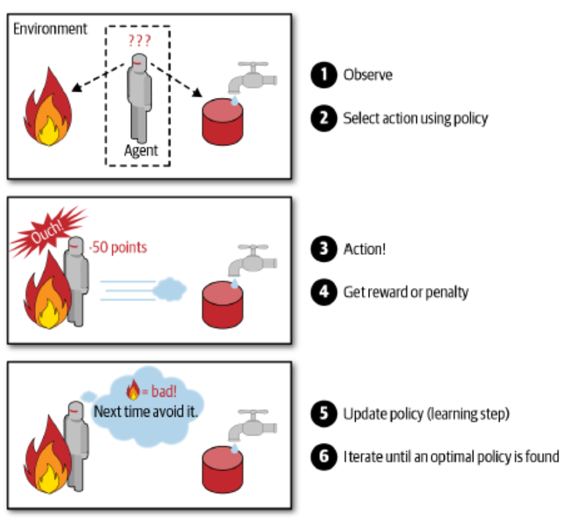

# 지도학습(Supervised learning)

> 특징 벡터 𝕏와 목표값 𝕐가 모두 주어진 상황으로, 정답이 있는 데이터를 활용해 데이터를 학습하는 것이다.

- **Classification**

- **Regression**

# 비지도학습(Unsupervised learning)

> 특징 벡터 𝕏는 주어지는데 목표값 𝕐가 주어지지 않는 상황으로, 정답 라벨이 없는 데이터를 비슷한 특징끼리 군집화 하여 새로운 데이터에 대한 결과를 예측하는 방법이다.

- **Clustering**

- **Dimensionality reduction**

- **Anomaly/Novelty detection**

# 강화학습(Reinforcement learning)

> 분류할 수 있는 데이터가 존재하는 것도 아니고 데이터가 있어도 정답이 따로 정해져 있지 않으며 자신이 한 행동에 대해 보상(reward)을 받으며 학습하는 것이다.

**학습정책**

- 어떤 액션에 따라 보상을 줄지 패널티를 줄지 결정해야 한다.

- 그에 따라 머신이 최대 보상을 얻기 위한 학습을 거친다.

 

    

        
    

# 준지도학습(Semi-supervised learning)

> 일부는 𝕏와 𝕐를 모두 가지지만 나머지는 𝕏만 가진 상황으로, 목표값이 표시된 데이터와 표시되지 않은 데이터를 모두 훈련에 사용하는 것을 말한다.

**𝕏의 수집은 쉽지만, 𝕐는 수작업이 필요한 경우 유용하다.**

 
 

**Source:**

📖 핸즈온머신러닝, 2/E, 2020 (번역)
